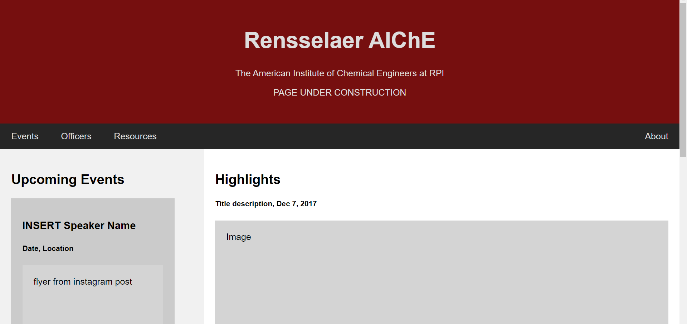

# RPI AIChE

## The Organization
Visit the Website: <i> Coming Soon </i>
 
The Rensselaer Chapter of the <a href="https://www.aiche.org">American Institute of Chemical Engineers</a> serves 
as community for chemical engineers to connect and network. This repo serves as the code base for the website. The 
website is maintained by chemical engineers at RPI. 

## The Code
The website runs on a Flask framework. It is currently under construction. More documentation will come soon. 

## References
<a> https://www.w3schools.com/howto/howto_make_a_website.asp </a>

### Color Schemes Options
https://www.schemecolor.com/underworld-empire.php (need mod)
https://www.schemecolor.com/perth-city-flag-colors.php

## Current Page Screenshots
